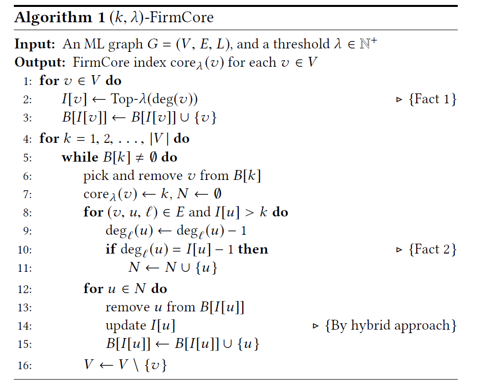

# 摘要

多层图中的稠密子图挖掘是图计算的一项基本任务, 已经在社交网络社区检测、图索引构建、DNA 中的监管主题发现、商品推荐等领域进行了广泛应用.但是在现实中, 多层图中的每一层可能属于不同的数据所有者, 不同的层中存在**数据隔离**, 数据所有者之间不能共享原始数据, 一个有效的解决方法是安全多方计算(SMPC), 安全多方计算使用混淆电路, 秘密共享等隐私原语保护了每一方的原始数据。我们是第一个将安全多方计算应用于多层图(ML graph)稠密子图挖掘领域, 我们提出了MPC-Firmcore算法, 针对具体的模型Firmcore[1]进行了隐私保护和算法优化, 以较小的开销实现多个数据库之间的安全计算, 证明了我们想法的可行性和安全性.

关键字: 多层图 稠密子图 安全多方计算

# 1 介绍

> 宽泛地概括各类问题和技术, 主要介绍问题的motivation和application,

随着大数据时代的发展, 数据隐私变得越来越重要, 许多机构和公司将数据使用分布式存储, 云存储等方式存储数据, 但是在数据使用时的隐私泄露问题也变得很严峻. 很多数据都可以使用多层图进行表示, 多层图上的信息挖掘工作已经取得了很多进展, 但是以前的工作并都是将整个多层图看成一个数据库整体, 并没有考虑隐私保护问题. 但是在现实中, 可能多层图中的每一层都属于不同的数据所有者, 举几个例子说明:

- 在中国, 存在很多社交网络app, 使用某个app的用户都需要一个手机号注册, 且每个手机号只能注册一个账号.我们可以将整个社交网络看成一个多层图, 每个用户是图中的一个节点, 每个社交网络app是多层图中的一层. 因为不同的社交软件属于不同的公司, 他们不能与其他的公司共享原始数据, 但是有时候多个公司之间想通过共有的数据进行一些用户信息的计算和分析.
- 供应链也可以被视为一个多层图，其中每一层指的是一个过程, 如生产过程, 制造过程, 销售过程; 制造商、分销商、零售商、供应商和物流提供商等可以被看成一个节点，多层图的边表示以及它们之间的交易、运输和合同关系。每个过程可能被不同的部门管理，供应链中的各方需要在不泄露敏感信息的情况下, 合作优化库存管理、需求预测和风险评估.

稠密子图发现(DSD)[1]问题的目的是找出多层图中的稠密结构, DSD是多层图领域的一个经典问题, 有着十分广泛的应用. 它可以用于分析社交网络中的人际关系, 生物信息学中的物质结构, 以及网络安全中的潜在攻击等. 我们的工作在Firmcore算法的基础上进行改进, 因为Firmcore算法本身比较简单, 其次各层可以较大程度独立地进行数据获取和计算, 便于实现安全多方计算.

隐私计算已经在很多领域进行了广泛和深入的探索, 如应用于KNN问题[2], 室内定位服务问题和联邦学习等, 但是并没有在多层图领域进行系统的研究, 这篇论文对该领域的内容进行了一个初步的探索, 我们使用安全多方计算来实现多层图Firmcore算法的隐私保护版本SMPC-Firmcore, 并针对算法做了多种优化, 以提高算法的运行效率. 总之, 我们的主要贡献为:

1. 首次提出了将安全多方计算应用于多层图计算领域
2. 实现了隐私安全版本的Firmcore算法
3. 对新的算法进行了性能优化, 并在多个数据集上测试得到结果
4. 在计算中加上差分隐私噪声...

# 2 问题背景

> 较为详细地介绍每一项技术的内容

## 2.1 多层图上的稠密子图发现

DSD问题需要我们找出图中的稠密子图, 这主要包括几种问题: (1) 什么样的子图能称之为稠密? (2) 如何找到这样的子图 ? (3) 整个算法的时间复杂度. 以前人们也提出了很多用来解决单层图上该问题的算法, 较简单的如k-core, k-truss, k-clique和k-plex等, 近年来也有新的针对于多层图上该算法的改进如Firmcore, FirmTruss(列举...)等等.

Firmcore算法是Farnoosh Hashemi等提出的一个解决DSD问题的有效方法, 属于core decomposition方法类别.他将每个图的最大的k-core定义为一个最稠密子图, 在单层图中, k-core的每个顶点都有至少k个邻居; 在多层图上, 我们不强制要求节点在每层上都有k个邻居, 而是引入一个松弛度$\lambda$, 定义k-core的每个顶点在至少$\lambda$层上都有至少k个邻居; 该算法使用较少的时间就能找出多层图中的稠密结构. 在本文中, 我们只考虑无向图的情况.

我们使用以前工作中ML图的定义. 我们令$G = (V, E, L)$ 表示一个无向ML图，其中 $V$ 是节点集，$L$ 是层集，$E ⊆ V ×V × L$ 是边集。层 $ℓ ∈ L$ 中节点 $v ∈ V$ 的邻居集合表示为 $N_ℓ(v)$，层 $ℓ$ 中 $v$ 的度数为 $deg_ℓ(v)$ = $|N_ℓ(v)|$.

Firmcore算法的主要过程如算法1所示. 首先计算每个节点i中第$\lambda$大的度, 写入数组$I[i]$, 数组B[d]记录第$\lambda$大的度为d的所有节点id.然后每次迭代地删除一个B[k]中的节点 which k是最小的值 which B[k]还不为空.删除一个节点v之后, 更新节点v的的每个邻居u的度, 如果u的度更新之后的值为I[u]-1, 那么u的第$\lambda$大的度的值可能需要更新; 更新所有需要更新I[u]的u值.将每个在key of B为k时删除的节点v记为$core_\lambda(v)$, 说明节点v在多层图ML, 松弛度为$\lambda$的k-core中.

## 2.2 安全多方计算

安全多方计算(SMPC)是一种先进的密码学范式，旨在实现数据的隐私保护与联合计算。在SMPC框架下，不存在一个可靠的代理, 多个参与方可以安全地进行协同计算，而无需泄露自己的私有输入数据。这种技术的核心是确保即使在存在恶意参与者的情况下，也能保护数据的安全性和完整性。安全多方计算已经有很多的实现方法, 最重要的有混淆电路, 秘密共享, 不经意传输和同态加密等

安全多方计算中的每一方数据库被视为一个数据孤岛, 即其不能与其他任何数据库共享原始数据, 发送数据之前必须要将数据进行加密处理, 比如排序算法只能使用oblivious排序算法如Bitonic mergesort算法.

我们使用框架MPyC[]来实现安全多方计算, 其底层原理为秘密共享, 支持多种oblivious算法如排序, bool判断等.

## 2.3 Different Oblivious

> 等会再看要不要写这一段

# 3 问题定义

## 3.1 ML Graph in SMPC

一共有m个数据提供者$P=\{P_1, P_2, ...P_m\}$, 每一个数据提供者$P_i$都有一个单层图数据集$G_i$, 各方的图两两之间都是同态的, 换句话说, 所有的单层图都是一个2.1中介绍的m层的多层图中的一层, 任何$P_i$都不知道任何数据库$G_j$ where $i ≠ j$ 的任何信息. 给定一个参数$\lambda$, 我们要求使用安全多方计算, 由每一方将各自的数据广播到其他数据提供者, 每一方通过获取的数据在自己本地进行安全的Firmcore图计算, 得到最终的结果, 即每个节点$v$的$core_\lambda(v)$. 各方的原始数据不应该被泄露, 且各方数据获取的数据满足$(\epsilon, \delta)-dp$差分隐私.表1总结了本文中常用的符号.

| 符号 | 描述                                       |
| ---- | ------------------------------------------ |
| P    | 数据提供者                                 |
| G    | 数据提供者拥有的单层图(或者说多层图的一层) |
| V    | 图的节点集合                               |
| E    | 图的边集合                                 |
| m    | 数据提供者的数量                           |
| λ    | Firmcore算法中松弛量参数                   |
|      |                                            |
|      |                                            |

安全模型: 我们使用的安全模型为semi-honest adversary模型, 在SMPC中, 各方之间不存在共谋, 且遵守相关安全协议, 但是每一方数据提供者都是诚实且好奇的, 他们会通过获取的数据来推测其他各方的敏感数据.

效率要求: 算法应该在较短的时间内完成计算, 时间主要包括各方的通信时间和加密数据的计算时间, 因为我们可能需要处理大规模图数据的计算, 所以长时间的延迟的低效算法没有实际意义.我们主要关心的时间延迟在于oblivious算法, 它是整个算法过程中最主要的成本开销.

## 3.2 主要挑战

在多层图上进行安全多方计算的主要挑战是隐私和计算效率的保证, 以前的隐私计算通常建立较为简单的问题比如KNN, PIR, Private Union等等, 而在图上的计算问题本身较为复杂, 这对能否同时保证安全和效率有较大的困难. 在隐私计算中使用的是和输入数据无关oblivious算法, 这和明文算法有较大的区别, 所以需要重新构造算法过程, 并从不同的角度优化算法.

# 4 SMPC-Firmcore算法

## 4.1 Baseline

传统的安全多方计算一般要求所有的数据都在加密状态下传输和计算, 但是这样的算法效率太低, 尤其是在多层图节点很多的情况下. 所以我们在算法中允许泄露一部分中间结果.我们将2.1中介绍的算法实现为安全多方计算版本.

首先, 每一方拥有多层图中的一层, 每一方在本地计算出各自层每个节点的度, 然后通过加密形式发送到其他各方, 这样每一方都维护一个全局所有层的形状为m*V的度矩阵, 计算每个节点在所有层中第$\lambda$大的度: 数组I, 然后获取I的明文, 同时通过明文的I计算B, 这样每一方都维护一个相同的明文I和B, 但是不知道每一方的节点准确的度, 然后每次迭代时, 各方在本地将I同一个度为k的节点删除, 更新本地的度矩阵, 并更新I中可能需要更新的节点.

我们称每一次获取节点并将其删除的操作称为`delete`, 而将$k=k_i$时所有的`delete`操作称为一次`Iteration`.

> 算法1伪代码

## 4.2 算法的改进

以上的算法完全是按照Firmcore中的算法步骤进行, 但是需要逐个删除所有的节点, 每次删除一个节点, 最多需要更新其所有邻居的度和I值, 其复杂度约为$O(V^2)$, 当节点数很多时, 效率会降低, 所以我们使用一种批量删除节点的方法, 减少delete的总次数, 从而降低时间复杂度.

我们改进的核心思想是每次delete不是只删除一个节点, 而是删除所有I中值为k的节点, 再在本地更新数组I, 直到I中的值全部大于k. 改进的算法无需维护全局的矩阵, 因为每次迭代都会重新计算该矩阵. 算法2的时间复杂度为$O(\alpha * V)$, 其中$\alpha$为需要delete的次数, 一般来说$\alpha$远小于$V$, 取决于图的密度.

>  算法2伪代码

算法2也有不足之处, 因为算法2虽然delete的次数较少, 但是每次delete的开销较大, 当每次迭代即将结束时, 每次delete能删除的节点会迅速减少, 但是每次delete仍要重新计算全局节点的I值, 这将造成很大不必要的开销. 所以我们综合算法1和算法2, 提出算法3, 其核心思想是, 每次迭代开始时, 使用算法2的删除方式, 当每次迭代到最后$\beta$个节点时, 使用算法1的删除方式.

> 数据可视化图: 每次迭代中每次delete中删除的节点个数

> 算法3的伪代码

## 4.3 算法分析

效率和安全的平衡: 我们并没有完全保证各方数据的安全性, 因为将每个步骤都进行oblivious计算会使得计算成本开销极大地增大.在我们的算法中, 每一方在每次delete之后都将获取明文的I值, [但是我们已经极大地减少了明文值泄露的信息, 比如我们的每次获取I的明文值之前都将I中值大于k的值, 也就是我们此次delete中用不到的值隐藏掉]

证明算法的复杂度:

> 列公式

证明算法的安全性(或者有多少安全性)

>

# 5 实验

数据集

baseline--原算法--每次删除全部节点--两种方法综合起来

指标: 算法运行时间/每一个步骤的时间

所有计算方的数量m - 时间变化

改变参数λ的值 - 时间变化

改变图中顶点数量(真实图/合成图) - 时间变化

改变图的疏密程度(密度) - 时间变化

# 6 相关工作

- 安全多方计算:
-

# 7 结论

# 8 参考文献